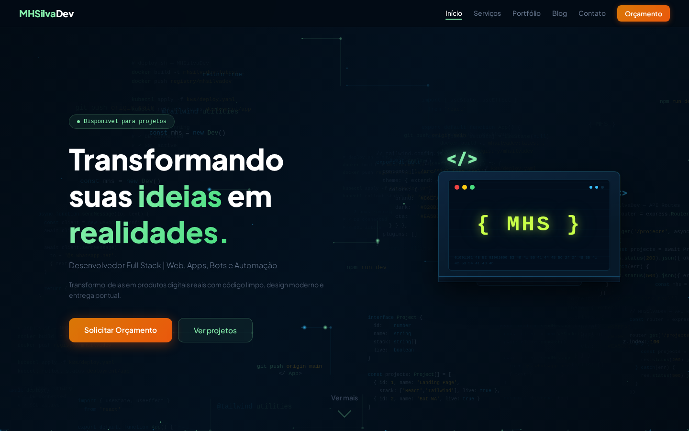
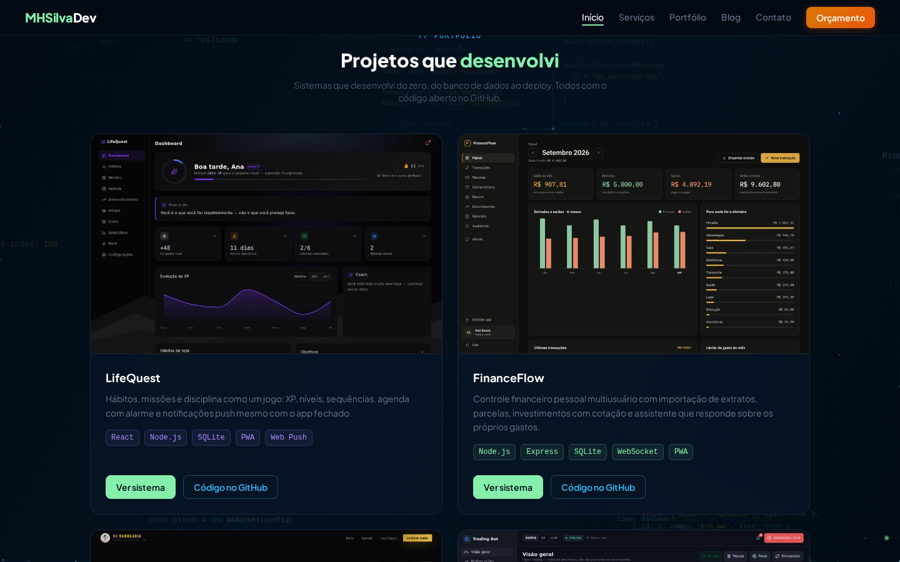
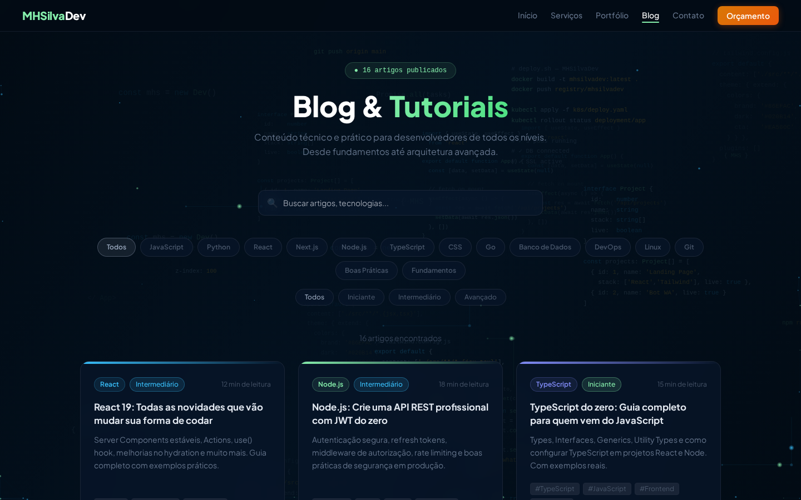
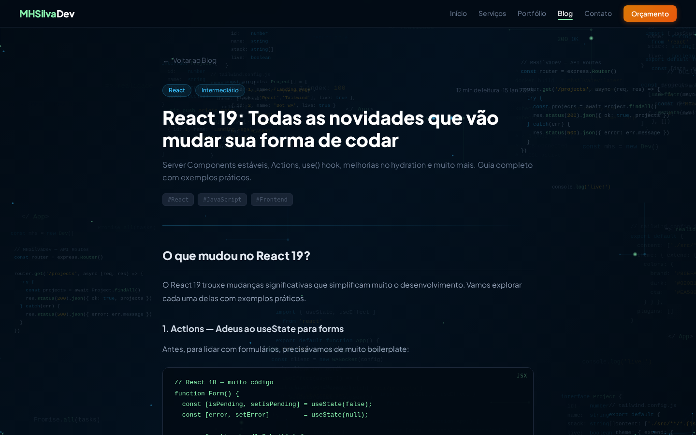
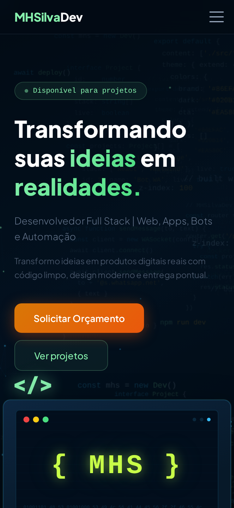

# MHSilvaDev — Site pessoal e portfólio

[](https://github.com/Mhsilva-dev/mhsilvadev-site/actions/workflows/ci.yml)

Site profissional com portfólio de projetos, página de serviços e um blog técnico com 17 artigos. Feito em React, com animações próprias em canvas e layout responsivo.

**🔗 No ar:** [mhsilvadev.com.br](https://mhsilvadev.com.br)


<p align="center">
  
</p>

## Telas

| Portfólio | Serviços |
|---|---|
|  |  |

| Blog | Artigo |
|---|---|
|  |  |

<p align="center">
  
</p>

## Funcionalidades

- **Portfólio** com os projetos em produção, cada um com print, tecnologias, link do sistema e do código
- **Serviços** com o que é oferecido e chamada direta para orçamento pelo WhatsApp
- **Blog** com busca por título ou tag e filtros por categoria e nível
- **Artigo** com barra de progresso de leitura, blocos de código e artigos relacionados da mesma categoria
- **Fundo animado** em `<canvas>`: partículas e trechos de código flutuando, desenhados com `requestAnimationFrame`
- Animações de entrada das seções com `IntersectionObserver`
- Navegação entre páginas e rolagem suave até as seções da home

## Estrutura

```
src/
├── App.jsx                  rotas
├── main.jsx
├── index.css
├── constants.js             contato, redes sociais e menus
├── components/
│   ├── Navbar.jsx           menu responsivo
│   ├── Footer.jsx           rodapé com navegação e contato
│   ├── ParticleCanvas.jsx   fundo animado em canvas
│   ├── LaptopMockup.jsx     ilustração do hero
│   └── ProjectCard.jsx      card de projeto do portfólio
├── pages/
│   ├── HomePage.jsx         hero, portfólio, serviços, blog e contato
│   ├── ServicesPage.jsx     /servicos
│   ├── BlogPage.jsx         /blog
│   └── BlogPost.jsx         /blog/:slug
├── data/
│   ├── projects.js          projetos do portfólio
│   └── blogPosts.js         artigos do blog
└── hooks/
    └── useIntersection.js   detecta quando uma seção entra na tela
```

## Rotas

| URL | Página |
|---|---|
| `/` | Página inicial |
| `/servicos` | Serviços |
| `/blog` | Lista de artigos com busca e filtros |
| `/blog/:slug` | Artigo |

## Como rodar localmente

Requisitos: Node.js 20 ou superior.

```bash
git clone https://github.com/Mhsilva-dev/mhsilvadev-site.git
cd mhsilvadev-site
npm install
cp .env.example .env   # dados de contato exibidos no site
npm run dev
```

Acesse `http://localhost:5173`. Para gerar a versão de produção: `npm run build` (saída em `dist/`).

## Deploy

O site é estático: o `dist/` gerado pelo Vite é servido pelo Nginx em uma VPS Linux, com SSL do Let's Encrypt. Como é uma SPA, o Nginx redireciona as rotas para o `index.html` (`try_files $uri /index.html`).

## Autor

Desenvolvido por **Matheus Henrique Fonseca Silva** — [github.com/Mhsilva-dev](https://github.com/Mhsilva-dev)
